Loka SDK
=============

-   [Introduction](#introduction)

-   [Requirements](#requirements)

-   [SDK Installation](#sdk-installation)

-   [Bootloader](#bootloader)

-   [Build the Project](#build-the-project)

-   [Upload Firmware to the Board](#upload-firmware-to-the-board)

-   [API Documentation](#api-documentation)

    -   [rtos.h](#rtosh)
	
	-   [InputOutput.h](#inputoutputh)

    -   [Loka.h](#lokah)

       -   [Board](#board)
	   
	   -   [Parameters](#parameter)
	   
	   -   [Watchdog](#watchdog)
	   
	   -   [GPIO](#gpio)
	   
	   -   [Analog](#analog)
	   
    -   [interruptions.h](#interruptionsh)
	
	-   [timer.h](#timerh)

    -   [SerialPort.h](#serialporth)
	
	-   [console.h](#consoleh)
	
	-   [SigfoxProtocol.h](#sigfoxprotocolh)
	
	-   [LIS3DE.h](#lis3deh)   
	
    -   [ESP8266.h](#esp8266h)

	
-   [Docking Station](#docking-station)

   
-   [Code Examples](#code-examples)

    -   [Generic Examples](#generic-examples)
	
    -   [Sensor Examples](#sensor-examples)
	

Introduction
------------

This repository provides the SDK for the LOKA development board.

The Loka Module System is revolutionary in its ability to be both flexible and scalable. Is composed by a multi-purpose board, a device management and geo location tool. The objective is to be the IoT platform of choice due to low cost, high flexibility and availability.

The multipurpose module, whose main function is a standalone low cost tracker, can be used as a mother board or a daughter board allowing to connect a variety of sensors.
This revolutionary concept, It addresses the cost and the Time to Market problem to introduce the many new services that are made possible by low power, low cost Sigfox network.

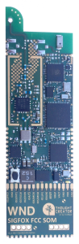  

For more information click [here](http://www.thought-creator.com/loka/).

**Contents:**

- Include folder with the *.h files from the SDK

- Examples folder with some CCS projects with code examples already configured and ready to build

- Tools folder with some helper programs, like the python FirmwareProgrammer script

Requirements
------------

-   Code Composer Studio - [Webpage](http://www.ti.com/tool/ccstudio)

-   TC Firmware Loader - [Download](http://www.thought-creator.com/wp-content/uploads/2015/03/FemtoFirmwareLoader.zip)

-   Python v2 / v3 with the pySerial package installed (pip install pySerial) (To run the FirmwareProgrammer script)

SDK Installation
----------------

**Configure Code Composer Studio (CCS)**

-   Create a new CCS project

>   Choose the target MSP430F5244 from thhe MSP430x5xx Family

>   Give a new project name and chose the compiler version: "TI v15.12.3.LTS"

>   Choose Empty project(with main.c)

>   Create the project and remane the main.c to main.cpp

-   Add the “--ti\_txt” flag on the project build settings

>   Project-\>Show Build Settings-\> MSP430 Hex Utility-\>Edit Flags

>   Add the “--ti\_txt” at the end of the flags line.

>   Verify if the flags are defined as: “--memwidth=8 --romwidth=8 --ti\_txt”

>   Store the config

-   Set up the C system stack size and heap size

>   Project-\>Show Build Settings-\> MSP430 Linker-\>Basic Options

>   Set the C system stack size to: 2048

>   Set Heap size for C/C++ dynamic memory allocation to: 3072

>   Store the config

-   Project-\>Show Build Settings-\> MSP430 Compiler-\>Advanced Options-\>Library Function Assumptions

>   Set level of printf/scanf support required to: full

>   Store the config

-   Copy te include folder to the root of the project folder and add the tc-rtos-lib.lib inside.

>   Copy the include folder to the root of the project

>  Add the tc-rtos-lib.lib file to the include folder

>  NOTE: The project examples on this repository already are configured to include the indclude folder on the build process.

Bootloader
----------

The LOKA board already provides a bootloader shell to facilitate the firmware upload and the paramater configuration.

To access the bootloader, please follow the next steps.

-   Power off the Board

-   Connect the board serial port using a baudrate of 115200

-   Power on the board and press Ctrl+C right after it.

The Bootloader shell avalilable commands:

-   help

-   reset

-   param list

-   param get \<param\_name\>

-   param set \<param\_name\> \<param\_value\>

-   param unset \<param\_name\> \<param\_value\>

-   param clean

-   console update

-   network update \<url\>

-   sigfox id

NOTE: Before use the network update \<url\> command, make sure that te wifi configuration is already correctly set.
If not, please run the following command to configure it: "param set wifi \<SSID\>,\<password\>".

Build the Project
-----------------

-   Compile the project and save the “\<project_name\>.txt” file from the Debug/Release folder to a known location.

-   After this step the firmware could be uploaded to the LOKA board following the instructions below.

Upload Firmware to the Board
----------------------------

Download the already provided Firmware Programer application script - [Downoad](Tools/FirmwareProgrammer.py)

-   Power off the Board

-   Open a new shell terminal on the SDK repository folder and type the following command: "python Tools/FirmwareProgrammer.py \<path_to_the_firmware_file\> \<serial_port\>"

-   Power on the board and wait the program to finish the processs. It will log every step done.

Alternative firmware loader windows application - [Download](http://www.thought-creator.com/wp-content/uploads/2015/03/FemtoFirmwareLoader.zip).

For more information, please refer to the manual avaliable [here](http://www.thought-creator.com/wp-content/uploads/2016/10/Loka-Firmware-Load.pdf).

API Documentation
-----------------

### rtos.h

The rtos.h class implements the the tc_rtos_init method that is the base of all LOKA SDK programs. It it absolute necessary to be called right at the start of the main.c function.
If receives a debug flag as argument, that if it is enabled, the serial port will be initialized with baudrate: 115200

| **Method**                | **Description**                                     | **Syntax**                    | **Parameters**                                                                          | **Return**                   |
|---------------------------|-----------------------------------------------------|-------------------------------|-----------------------------------------------------------------------------------------|------------------------------|
| tc\_rtos\_init(int debug) | Initializes the TC RTOS with or without debug mode. | int tc\_rtos\_init(int debug) | debug: Debug mode flag. Possible Values: 0 without debug enabled. 1: with debug enabled | 1 if Success. 0 if error.    |

### InputOutput.h

#### Pin Layout

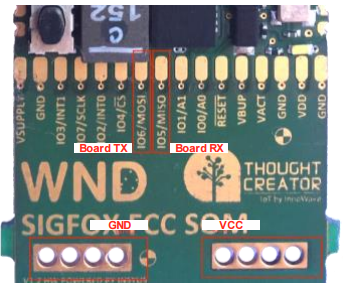  

| **Pin Name**         | **Description**           | **Interruption**         |
|----------------------|---------------------------|--------------------------|
| IO0                  | GPIO / A0                 | No                       |
| IO1                  | GPIO / A1                 | No                       |
| IO2                  | GPIO / INT0               | Yes                      |
| IO3                  | GPIO / INT1               | Yes                      |
| IO4                  | GPIO / _SC                | No                       |
| IO5                  | GPIO / MISO / Rx Serial   | No                       |
| IO6                  | GPIO / MOSI / Tx Serial   | No                       |
| IO7                  | GPIO / SCLK               | Yes                      |
| BUTTON               | GPIO                      | Yes                      |
| LED                  | GPIO                      | No                       |
| ACCELEROMETER        |                           | Yes                      |

Edge Enum:

- FALLING
- RISING

State Enum:

- HIGH
- LOW

Mode Enum:

- INPUT
- OUTPUT
- INPUT_PULLDOWN

NOTE: By Default in the CPU internal resistor is set to PULLDOWN. Otherwise "digitalWrite(HIGH)" must be called to change it to PULLUP.

### Loka.h

The Loka.h class implements the most generic methods to configure the behavhiour of te LOKA board, like the CPU , parameters configuration, GPIO, and Watchdog related.

#### Board

The following methods retrieves and allow the configuration of the LOKA CPU.

| **Method**                                                 | **Description**                                                                                          | **Syntax**                                                                   | **Parameters**                                                                                                                                 | **Return**                                                                                      |
|------------------------------------------------------------|----------------------------------------------------------------------------------------------------------|------------------------------------------------------------------------------|------------------------------------------------------------------------------------------------------------------------------------------------|-------------------------------------------------------------------------------------------------|
| reset()                                                    | Forces the board to reset itself.                                                                        | static void Loka::reset()                                                    | None                                                                                                                                           | None                                                                                            |
| resetCause(char\* message)                                 | Gets the latest reset cause message. 								                                    | static void Loka::resetCause(char\* message)                                 | message - The reset cause message to be logged.                                                                                                | None                                                                                            |
| set1MHzBoosterOffMode()                                    | Sets the board CPU frequency to 1Mhz and turns Off the Booster.                                          | static void Loka::set1MHzBoosterOffMode()                                    | None                                                                                                                                           | None                                                                                            |
| set24MHzBoosterOnMode()                                    | Sets the board CPU frequency to 24Mhz and turns On the Booster.                                          | static void Loka::set24MHzBoosterOnMode()                                    | None                                                                                                                                           | None                                                                                            |
| setLowPowerMode(int duration)                              | Sets the board to into low power mode for the specified duration.                                        | static char\* Loka::setLowPowerMode(int duration)                            | duration: The low power mode duration in seconds.                                                                                              | None                                                                                            |
| getCurrentFrequency()                                      | Gets the current CPU frequency value.                                                                    | static unsigned long Loka::getCurrentFrequency()                             | None                                                                                                                                           | CPU Current Frequency                                                                           |
| getTemperature()                                           | Gets the board temperature.                                                                              | static double Loka::temperature()                                            | None                                                                                                                                           | Current board Temperature in ºC.                                                                |
| getInputVoltage()                                          | Gets the board input voltage.                                                                            | static double Loka::getInputVoltage()                                        | None                                                                                                                                           | Current board input voltage in Volts.                                                           |

#### Parameters

The following methods allow the configuration of a a set of parameters that will be stored on the flash memory. These are presistent on power loss.

| **Method**                                                 | **Description**                                                                                          | **Syntax**                                                                   | **Parameters**                                                                                                                                 | **Return**                                                                                      |
|------------------------------------------------------------|----------------------------------------------------------------------------------------------------------|------------------------------------------------------------------------------|------------------------------------------------------------------------------------------------------------------------------------------------|-------------------------------------------------------------------------------------------------|
| eraseConfig()                                              | Erases the board stored parameter list.                                                                  | static void Loka::eraseConfig()                                              | None                                                                                                                                           | None                                                                                            |
| getConfig(const char\* *parm\_s, char\** value)            | Checks if the given parameter is already stored on the board and returns its value by reference.         | static void Loka::getConfig(const char\* *parm\_s, char\** value)            | parm\_s: The parameter which we want to get the stored value. value: The parameter value itself.                                               | Parameter value by reference if existent. ‘\\0’ otherwise.                                      |
| getConfig(const char\* *parm\_s, char\** value, int index) | Checks if the given parameter is already stored on the board and returns its values[index] by reference. | static void Loka::getConfig(const char\* *parm\_s, char\** value, int index) | parm\_s: The parameter which we want to get the stored value. value\_s: The parameter value itself. index: The parameter value index position. | Parameter values by reference accordingly with the index position if existent. ‘\\0’ otherwise. |
| setConfig(const char\* *parm\_s, char\** value\_s)         | Sets the given parameter value on the board flash memory.                                                | static void Loka::setConfig(const char\* *parm\_s, char\** value\_s)         | parm\_s: The parameter you want to set on the board flash memory. value\_s: The parameter value itself.                                        | None                                                                                            |

#### Watchdog

A watchdog timer is an electronic timer that is used to detect and recover from computer malfunctions.
Typically it will reset the CPU processor and restart the program into a normal system operation.
The following methods allow the LOKA watchdog to be reset or even disabled. (It is enabled by dafault)

| **Method**                                                 | **Description**                                                                                          | **Syntax**                                                                   | **Parameters**                                                                                                                                 | **Return**                                                                                      |
|------------------------------------------------------------|----------------------------------------------------------------------------------------------------------|------------------------------------------------------------------------------|------------------------------------------------------------------------------------------------------------------------------------------------|-------------------------------------------------------------------------------------------------|
| disableWatchdog()                                          | Disables the board CPU watchdog. The TC-RTOS enables the board CPU watchdog by default.                  | static void Loka::disableWatchdog()                                          | None                                                                                                                                           | None                                                                                            |
| watchdogReset()                                            | Resets the CPU watchdog counter. The TC-RTOS enables the board CPU watchdog by default.                  | static void Loka::watchdogReset()                                            | None                                                                                                                                           | None                                                                                            |

#### GPIO

The GPIO methods configure the board pin modes and reads/writes the pin status values.

| **Method**                                                 | **Description**                                                                                          | **Syntax**                                                                   | **Parameters**                                                                                                                                 | **Return**                                                                                      |
|------------------------------------------------------------|----------------------------------------------------------------------------------------------------------|------------------------------------------------------------------------------|------------------------------------------------------------------------------------------------------------------------------------------------|-------------------------------------------------------------------------------------------------|
| pinMode(digio gpio*, uint8\_t mode)                        | Sets the GPIO pin to the given mode.                                                                     | static void Loka::pinMode(digio *gpio, uint8\_t* mode)                       | gpio: The GPIO pin. mode: The desiged GPIO pin mode. Possible mode values: OUTPUT, INPUT                                                       | None                                                                                            |
| digitalWrite(digio gpio*, uint8\_t* value)                 | Sets the GPIO pin to the given value.                                                                    | static void Loka::digitalWrite(digio *gpio, uint8\_t* value)                 | gpio: The GPIO pin. value: The value itself.                                                                                                   | None                                                                                            |
| digitalRead(digio gpio*)                                   | Gets the GPIO pin value.                                                                                 | static unsigned char *Loka::*digitalWrite(digio *gpio, uint8\_t* value)      | gpio: The GPIO pin.                                                                                                                            | The GPIO value.                                                                                 |

#### Analog

The Analog pins method to read pin analog value. User don't need to configure the pinMode to use the analogRead function, just call the analogRead function with the analog pin you want to read.

| **Method**                                                 | **Description**                                                                                          | **Syntax**                                                                   | **Parameters**                                                                                                                                 | **Return**                                                                                      |
|------------------------------------------------------------|----------------------------------------------------------------------------------------------------------|------------------------------------------------------------------------------|------------------------------------------------------------------------------------------------------------------------------------------------|-------------------------------------------------------------------------------------------------|
| analogRead(digio gpio*)                                    | Gets the GPIO pin Analog value.                                                                          | static unsigned int Loka::analogRead(digio *gpio)                            | gpio: The GPIO analog pin.                                                                                                                     | The GPIO analog value. From 0 to 1023, 0 represents 0V while 1023 represents 2,5V.              |

### interruptions.h

The interruptions.h class provides the methods to handle the CPU interruptions uing the board GPIO pins.

| **Method**                                | **Description**                                       | **Syntax**                                          | **Parameters**                                                                                                                | **Return**                                                                  |
|-------------------------------------------|-------------------------------------------------------|-----------------------------------------------------|-------------------------------------------------------------------------------------------------------------------------------|-----------------------------------------------------------------------------|
| intConnect(digio io, ISR\_FUNC\_PTR func) | Calls the callbck 'func' function.                    | uint8\_t intConnect(digio io, ISR\_FUNC\_PTR func)  | io: The board GPIO pin with interruption. func: The callback function.                                                        | HAL\_DIGIO\_OK - in case of sucesss.  HAL\_DIGIO\_ERROR - in case of error. |
| intEnable(digio io, ISR\_FUNC\_PTR func)  | Enables the interruption.                             | uint8\_t intEnable(digio io)                        | io: The board GPIO pin with interruption.                                                                                     | HAL\_DIGIO\_OK - in case of sucesss.  HAL\_DIGIO\_ERROR - in case of error. |
| intDisable(digio io)                      | Disables the interruption.                            | uint8\_t intDisable(digio io)                       | io: The board GPIO pin with interruption.                                                                                     | HAL\_DIGIO\_OK - in case of sucesss.  HAL\_DIGIO\_ERROR - in case of error. |
| intClear(digio io)                        | Clears the interruption internal flags.               | uint8\_t intClear(digio io)                         | io: The board GPIO pin with interruption.                                                                                     | HAL\_DIGIO\_OK - in case of sucesss.  HAL\_DIGIO\_ERROR - in case of error. |
| intSetEdge(digio io)                      | Sets the edge that will trigger the interruption.     | uint8\_t intSetEdge(digio io, uint8\_t edge)        | io: The board GPIO pin with interruption. edge: The edge that will trigger the interruption. Possible Values: RISING/FALLING  | HAL\_DIGIO\_OK - in case of sucesss.  HAL\_DIGIO\_ERROR - in case of error. |

### timer.h

The timer.h class provides the methods to handle the CPU real time clock, and retrive the board uptime.

| **Method**                                                                                | **Description**                                                   | **Syntax**                                                                                           | **Parameters**                                                                                                                                            | **Return**                                                                  |
|-------------------------------------------------------------------------------------------|-------------------------------------------------------------------|------------------------------------------------------------------------------------------------------|-----------------------------------------------------------------------------------------------------------------------------------------------------------|-----------------------------------------------------------------------------|
| sleep(unsigned long seconds)                                                              | Sleep for the specified number of senconds                        | void sleep(unsigned long seconds)                                                                    | seconds: The number of seconds.                                                                                                                           | None                                                                        |
| usleep(unsigned long milliseconds)                                                        | Sleep for the specified number of milliseconds                    | void usleep(unsigned long milliseconds)                                                              | miliseconds: The number of miliseconds.                                                                                                                   | None                                                                        |
| delay(unsigned long milliseconds)                                                         | Sleep for the specified number of milliseconds                    | void delay(unsigned long milliseconds)                                                               | miliseconds: The number of miliseconds.                                                                                                                   | None                                                                        |
| millis()                                                                                  | Gets the current timestamp in miliseconds                         | unsigned long millis()                                                                               | None                                                                                                                                                      | The current timestamp in miliseconds.                                       |
| setTime(int32_t ts)                                                                       | Sets the current timestamp in seconds                             | void setTime(int32_t ts)                                                                             | ts: The current timestamp in seconds.                                                                                                                     | None                                                                        |
| getTime()                                                                                 | Gets the current timestamp in seconds                             | int32_t getTime()                                                                                    | None                                                                                                                                                      | The current timestamp in seconds.                                           |
| getUptime()                                                                               | Gets the current board uptime in seconds                          | int32_t getUptime()                                                                                  | None                                                                                                                                                      | The current board uptime in seconds.                                        |

### SerialPort.h

The SerialPort.h class provides the methods to handle the CPU seial port.

| **Method**                                                                                | **Description**                                                   | **Syntax**                                                                                           | **Parameters**                                                                                                                                            | **Return**                                                                   |
|-------------------------------------------------------------------------------------------|-------------------------------------------------------------------|------------------------------------------------------------------------------------------------------|-----------------------------------------------------------------------------------------------------------------------------------------------------------|------------------------------------------------------------------------------|
| init(int id)                                                                              | Initializes the SeialPort with the default baudrate 9600          | int init(int id)                                                                                     | id: The Serial Port Id  (Default: 0)                                                                                                                      | 1 if Success. -1 if error.                                                   |
| init(int id, long baudRate)                                                               | Initializes the SeialPort the specified baudrate                  | int init(int id, long baudrate)                                                                      | id: The Serial Port Id  (Default: 0) baudrate: The specified baudrate.                                                                                    | 1 if Success. -1 if error.                                                   |
| init(int id, long baudRate, unsigned long txBuffer, unsigned long rxBuffer)               | Initializes the SeialPort the specified baudrate and buffers size | int init(int id, long baudRate, unsigned long txBuffer, unsigned long rxBuffer)                      | id: The Serial Port Id  (Default: 0) baudrate: The specified baudrate. txbuffer, rxbuffer: The buffers size.                                              | 1 if Success. -1 if error.                                                   |
| write(unsigned char *buffer, int size)                                                    | Writes to the SerialPort                                          | int write(unsigned char *buffer, int size)                                                           | buffer: The payload to send. size: The size of the payload.                                                                                               | Number of written bytes if Success. 0 if error.                              |
| write(char *buffer, int size)                                                             | Writes to the SerialPort                                          | int write(char *buffer, int size)                                                                    | buffer: The payload to send. size: The size of the payload.                                                                                               | Number of written bytes if Success. 0 if error.                              |
| write(uint8_t c)                                                                          | Writes to the SerialPort                                          | int write(uint8_t c)                                                                                 | c: The byte to be sent.                                                                                                                                   | Number of written bytes if Success. 0 if error.                              |
| write(char* buffer)                                                                       | Writes to the SerialPort                                          | int write(char* c)                                                                                   | buffer: The string array to be send.                                                                                                                      | Number of written bytes if Success. 0 if error.                              |
| read()                                                                                    | Reads from the SerialPort                                         | unsigned char read()                                                                                 | None                                                                                                                                                      | Retuns the content of the Rx Buffer of the Serial Port                       |
| available()                                                                               | Checks if there are any bytes on the SerialPort buffer            | unsigned int available()                                                                             | None                                                                                                                                                      | Returns the number of available bytes on the SerialPort buffer               |
| close()                                                                                   | Closes the SerialPort                                             | int close()                                                                                          | None                                                                                                                                                      | 0 if Success. -1 if error.                                                   | 
	
	
### console.h

The console.h class is just a helper implementation of some debug methods.
NOTE: It depends that the board debug flag on the tc_rtos_init(int debug) to be set as enabled.
(As already redered before, the serial port baudrate with the debug flag enabled is: 115200 and it it already initialized internaly by the TC RTOS)

| **Method**                         | **Description**                                       | **Syntax**                              | **Parameters**                                                   | **Return**                   |
|------------------------------------|-------------------------------------------------------|-----------------------------------------|------------------------------------------------------------------|------------------------------|
| console\_write(char \*output)      | Writes the output to the serial port.                 | void console\_write(char \*output)      | output: The output to be sent to thought the serial port         | None                         |
| console\_debug(char \*format, ...) | Writes the formated output string to the serial port. | void console\_debug(char \*format, ...) | format: The output string to be sent to throught the serial port | None                         |

### LIS3DE.h

The LIS3DE.h implements methods to configure and access the accelerometer of the Loka board. The Accelerometer can generate interruptions through the GPIO "ACCELEROMETER" pin, to do so, interruptions should be configured on accelerometer side (as described on this section) and on the main MCU side as described on [interruptions.h](#interruptionsh). This chip have two operating modes that are incompatible with each other. On one of the modes the device acts as a motion sensor and up to two types of movement can be configured (click and wakeUp), interrupts can be generated for each of them. On the other mode of operation it is possible to access the acceleration readings of the device, this mode uses an internal buffer with the FIFO policy. In this mode, interrupts can be configured to control the number of samples on the buffer.

| **Method**                                                                                                                           | **Description**                                                                                                                                                  | **Syntax**                                                                                                            | **Parameters**                                                                                                                                                                                                                                                                                                                                                                                                                                                                                                                                                                                                         | **Return**                                                                                                                                                                                                                                                                                                                                                       |
|--------------------------------------------------------------------------------------------------------------------------------------|------------------------------------------------------------------------------------------------------------------------------------------------------------------|-----------------------------------------------------------------------------------------------------------------------|------------------------------------------------------------------------------------------------------------------------------------------------------------------------------------------------------------------------------------------------------------------------------------------------------------------------------------------------------------------------------------------------------------------------------------------------------------------------------------------------------------------------------------------------------------------------------------------------------------------------|------------------------------------------------------------------------------------------------------------------------------------------------------------------------------------------------------------------------------------------------------------------------------------------------------------------------------------------------------------------|
|   init(uint8_t mode)                                                                                                                 | This function should be called before of any of the accelerometer functions, it initializes the accelerometer on one of the two operating modes described before.|   int init(uint8_t mode)                                                                                              |mode: Operating mode of the accelerometer,   Possible Values:   1-Motion Sensing Mode   2-Acceleration Reading Mode                                                                                                                                                                                                                                                                                                                                                                                                                                                                                            | Returns one int, if the configurations was succeed 1 otherwise returns -1                                                                                                                                                                                                                                                                                        |    
|   setAxis(uint8_t xx, uint8_t yy , uint8_t zz)                                                                                       | Enables or Disables the axis of the acelerometer                                                                                                                 |   void setAxis(uint8_t xx, uint8_t yy , uint8_t zz)                                                                   |xx: Enable or Disable xx Axis  yy: Enable or Disable yy Axis  zz: Enable or Disable zz Axis  Possible Values: 0 -Enable , 1 -Dissable                                                                                                                                                                                                                                                                                                                                                                                                                                                                          | None                                                                                                                                                                                                                                                                                                                                                             |
|	setRange(LIS3DE_range_t range)                                                                                                     | Sets the Acceleration range of the acelerometer                                                                                                                  |   void setRange(LIS3DE_range_t range)                                                                                 |range: range of the accelerometer,    Possible values:   LIS3DE_RANGE_2_G   LIS3DE_RANGE_4_G   LIS3DE_RANGE_8_G   LIS3DE_RANGE_16_G                                                                                                                                                                                                                                                                                                                                                                                                                                                                      | None                                                                                                                                                                                                                                                                                                                                                             |
|	getRange()                                                                                                                         | Gets the Acceleration range                                                                                                                                      |   int getRange(void)                                                                                                  |None                                                                                                                                                                                                                                                                                                                                                                                                                                                                                                                                                                                                                    | Returns the current Range config:   0-LIS3DE_RANGE_2_G   1-LIS3DE_RANGE_4_G    2-LIS3DE_RANGE_8_G    3-LIS3DE_RANGE_16_G                                                                                                                                                                                                                             |
|	setDataRate(LIS3DE_dataRate_t dataRate)                                                                                            | Sets the Accelerometer sampling Rate                                                                                                                             |   void setDataRate(LIS3DE_dataRate_t dataRate)                                                                        |dataRate: Sampling rate of the accelerometer; Possible Values:   LIS3DE_DATARATE_400_HZ   LIS3DE_DATARATE_200_HZ   LIS3DE_DATARATE_100_HZ   LIS3DE_DATARATE_50_HZ   LIS3DE_DATARATE_25_HZ   LIS3DE_DATARATE_10_HZ   LIS3DE_DATARATE_1_HZ   LIS3DE_DATARATE_POWERDOWN   LIS3DE_DATARATE_LOWPOWER_1K6HZ   LIS3DE_DATARATE_LOWPOWER_5KHZ                                                                                                                                                                                                                                                     | None                                                                                                                                                                                                                                                                                                                                                             |
|	getDataRate()                                                                                                                      | Gets current configuration for the accelerometer sampling rate                                                                                                   |   int getDataRate(void)                                                                                               |None                                                                                                                                                                                                                                                                                                                                                                                                                                                                                                                                                                                                                    | Returns the current data Rate config:   0-LIS3DE_DATARATE_POWERDOWN   1-LIS3DE_DATARATE_1_HZ   2-LIS3DE_DATARATE_10_HZ   3-LIS3DE_DATARATE_25_HZ   4-LIS3DE_DATARATE_50_HZ   5-LIS3DE_DATARATE_100_HZ   6-LIS3DE_DATARATE_200_HZ   7-LIS3DE_DATARATE_400_HZ    8-LIS3DE_DATARATE_LOWPOWER_1K6HZ   9-LIS3DE_DATARATE_LOWPOWER_5KHZ  |
|                          **Motion Sensing Mode Methods**                                                                             |
|	setWakeUp(uint8_t itr, uint8_t thresh, uint8_t timelimit = 1)                                                                      | Sets the wakeUp event configurations                                                                                                                             |   void setWakeUp(uint8_t itr, uint8_t thresh, uint8_t timelimit)                                                      |itr: configure if the event can generate interruptions on ACCELEROMETER pin   thresh: acceleration threshold to trigger the event    timelimit: acceleration duration level to trigger the event (directly correlected with the dataRate), Possible Values: 0-127 (default value 1)                                                                                                                                                                                                                                                                                                                               | None                                                                                                                                                                                                                                                                                                                                                             |
|	getWakeUp()                                                                                                                        | Gets the wakeUp event (check if occured)                                                                                                                         |   char getWakeUp(void)                                                                                                |None                                                                                                                                                                                                                                                                                                                                                                                                                                                                                                                                                                                                                    | Returns one byte, if the wakeUp event had ocurr 0x40 otherwise returns 0x00                                                                                                                                                                                                                                                                                      |
|	setClick(uint8_t mode, uint8_t clickthresh, uint8_t duration = 20, uint8_t timelatency = 30, uint8_t timewindow = 20)              | Sets the click event configurations                                                                                                                              |   void setClick(uint8_t mode, uint8_t clickthresh, uint8_t duration, uint8_t timelatency, uint8_t timewindow )        |mode: selects de click event mode, Possible Values:  0-Dissable   1-Enable Single Click   2-Enable Double Click   clickthresh: click event threshold, Possible Values: 0-127   duration: click event duration threshold (directly correlected with the dataRate), Possible Values: 0-127   timelatency: timelatency between clicks on double click mode (directly correlected with the dataRate), Possible Values: 0-255   timewindow: timewindow for the double click ocurr (directly correlected with the dataRate), Possible Values: 0-255                                                   | None                                                                                                                                                                                                                                                                                                                                                             |
|	getClick(void)                                                                                                                     | Gets the click event (check if occured)                                                                                                                          |   char getClick(void)                                                                                                 |None                                                                                                                                                                                                                                                                                                                                                                                                                                                                                                                                                                                                                    | Returns one byte, if the click (or double click) event had ocurr 0x20 otherwise returns 0x00                                                                                                                                                                                                                                                                     |
|                           **Acceleration Reading Mode Methods**                                                                      |
|	setWatermark(uint8_t level, uint8_t itr)                                                                                           | Sets the an virutal max level for the number of acceleration samples on the buffer (watermark), an interruption can be generated when the watermark is crossed   |   void setWatermark(uint8_t level, uint8_t itr)                                                                       |level: watermark level, Possible Values: 0-31   , itr: Interrupt Enable, Possible Values: 0-Disable 1-Enable                                                                                                                                                                                                                                                                                                                                                                                                                                                                                                         | None                                                                                                                                                                                                                                                                                                                                                             |
|	getWatermark()                                                                                                                     | Gets the current watermark level                                                                                                                                 |   int getWatermark(void)                                                                                              |None                                                                                                                                                                                                                                                                                                                                                                                                                                                                                                                                                                                                                    | Returns the watermark level, from 0 to 31                                                                                                                                                                                                                                                                                                                        |
|	checkWatermarkLevel()                                                                                                              | Checks if the watermark level was crossed                                                                                                                        |   int checkWatermarkLevel(void)                                                                                       |None                                                                                                                                                                                                                                                                                                                                                                                                                                                                                                                                                                                                                    | Returns 0x80 if the watermark leve was crossed, otherwise returns 0x00                                                                                                                                                                                                                                                                                           |
|	getNumberofAvailableSamples()                                                                                                      | Gets the number of the available samples stored in the buffer                                                                                                    |   int getNumberofAvailableSamples()                                                                                   |None                                                                                                                                                                                                                                                                                                                                                                                                                                                                                                                                                                                                                    | Retuns the number of available samples on the buffer, to be read                                                                                                                                                                                                                                                                                                 |
|	readAxis()                                                                                                                         | Reads one sample from the buffer                                                                                                                                 |   LIS3DE_Aceleration *  readAxis()                                                                                    |None                                                                                                                                                                                                                                                                                                                                                                                                                                                                                                                                                                                                                    | Retuns a pointer to the data structure of the type LIS3DE_Aceleration, that contains the accelerations readings, (in G) for each of the axis                                                                                                                                                                                                                     |

By default the init method initializes the device with an dataRate of 10Hz and the Range of 8G.
The Accelerometer IC is very sensible fast voltage variations so we recomend to performer the re-configuration every time that the Booster changes is state (On/Off).

### SigfoxProtocol.h

Finnaly, the SigfoxProtocol.h class implements the methods to handle the sigfox radio module configuration, and send sigfox messages.

| **Method**                                                                                | **Description**                                         | **Syntax**                                                                                           | **Parameters**                                                                                                                                            | **Return**                                                                  |
|-------------------------------------------------------------------------------------------|---------------------------------------------------------|------------------------------------------------------------------------------------------------------|-----------------------------------------------------------------------------------------------------------------------------------------------------------|-----------------------------------------------------------------------------|
| init(SigfoxMode sigfoxMode)                                                               | Initializes the Sigfox Radio in a certain mode          | static void init(SigfoxMode sigfoxMode)                                                              | SigfoxMode, RCZ1, RCZ2, RCZ3, RCZ4                                                                                                                        | None                                                                        |
| doRegister()                                                                              |                                                         | static int doRegister()                                                                              | None                                                                                                                                                      | 1 if Success. 0 if error.                                                   |
| sendGPIOValue(int gpio, char value)                                                       | Sends GPIO Message over Sigfox                          | static int sendGPIOValue(int gpio, char value)                                                       | gpio: The GPIO digital pin. value: The GPIO value.                                                                                                        | 1 if Success. 0 if error.                                                   |
| sendAnalogValue(int gpio, char value)                                                     | Sends Analog Message over Sigfox                        | static int sendAnalogValue(int gpio, double value)                                                   | gpio: The GPIO analog pin. value: The GPIO value.                                                                                                         | 1 if Success. 0 if error.                                                   |
| sendGPSPosition(double latitude, double longitude, double speed, double timestamp)        | Sends GPS Position over Sigfox                          | int sendGPSPosition(double latitude, double longitude, double speed, double timestamp)               | latitude, longitude: The GPS coordinates speed: The current speed. timestamp: The current timestamp                                                       | 1 if Success. 0 if error.                                                   |
| sendLog(char log)                                                                         | Sends Log Message over Sigfox                           | int sendLog(char log)                                                                                | log: The Log Message.                                                                                                                                     | 1 if Success. 0 if error.                                                   |
| sendDataLogger(int gpio, int32_t counter, int32_t time)                                   | Sends Data Logger Message over Sigfox                   | int sendDataLogger(int gpio, int32_t counter, int32_t time)                                          | gpio: The GPIO pin. counter: The counter. time: The timestamp.                                                                                            | 1 if Success. 0 if error.                                                   |
| getLastMessageTimestamp()                                                                 | Gets the timestamp of the last message sent over Sigfox | static int32_t getLastMessageTimestamp()                                                             | None                                                                                                                                                      | 1 if Success. 0 if error.                                                   |
| sendRawMessage(unsigned char *message, int size)                                          | Sends a RAW Message over Sigfox                         | static int sendRawMessage(unsigned char *message, int size)                                          | message: The message to send. size: The message size.                                                                                                     | 1 if Success. 0 if error.                                                   |
| sendRawDownlinkMessage(unsigned char *message, int size, unsigned char *response)         | Sends a RAW Message and expects a response over Sigfox  | static int sendRawDownlinkMessage(unsigned char *message, int size, unsigned char *response)         | message: The message to send. size: The message size. response: Reference to the variable where it will write the response message.                       | The number of bytes received.                                               |
	

Docking Station
-------------

The LOKA board have an Docking station that allows to connect to a set of diferent sensors (see [Sensor Examples](#sensor-examples)). The layout of the Docking Station is presented bellow.

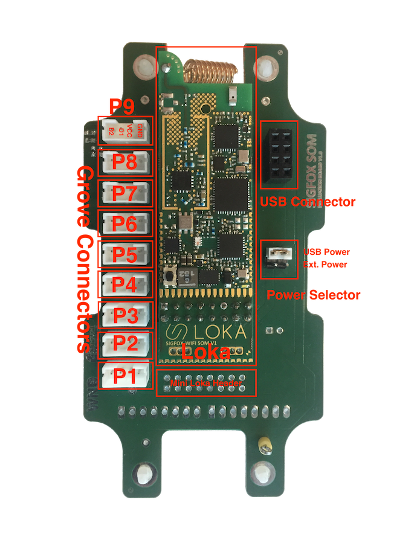 

#### Docking Layout

| **Port Name**         | **Conneted Pins**                                 | **Port Description**                        | **Category**       |
|-----------------------|---------------------------------------------------|---------------------------------------------|--------------------|
| P1                    | D1=IO0    D2=IO1                                  | Suports Analog inputs / GPIO                |  Analog/Digital    |
| P2                    | D1=IO1    D2=IO2                                  | Suports Analog inputs / GPIO                |  Analog/Digital    |
| P3                    | D1=IO2    D2=IO3                                  | GPIO                                        |  Digital           |
| P4                    | D1=IO3    D2=IO4                                  | GPIO                                        |  Digital           |
| P5                    | D1=IO4    D2=IO5                                  | GPIO                                        |  Digital           |
| P6                    | D1=IO5    D2=IO6                                  | Suports Serial Port / GPIO                  |  Serial/Digital    |
| P7                    | D1=IO6    D2=IO7                                  | Suports Serial Port Transmission / GPIO     |  Serial/Digital    |
| P8                    | D1=IO7    D2=none                                 | GPIO                                        |  Digital           |
| P9                    | D1=IO3    D2=IO4  (With I2C HW Pullup)            | Suports I2C                                 |  I2C               |

	
Code Examples
-------------

### Generic Examples

These are some generic code examples of the SDK usage.
The CCS projects already are pre-configured and ready to build.

| **Example**               | **Description**                       | **Code**                                           | 
|---------------------------|---------------------------------------|----------------------------------------------------|
| Hello World               | Print Hello World Message             | [Code](Examples/Basic/main.cpp)                    |
| Watchdog Reset Counter    | Resets the board watchdog             | [Code](Examples/WatchdogResetCounter/main.cpp)     |
| Watchdog Disable          | Disables the board watchdog           | [Code](Examples/WatchdogDisable/main.cpp)          |
| GPIO                      | GPIO on output mode example           | [Code](Examples/InputOutput/main.cpp)              |
| Analog                    | How to read an analog value           | [Code](Examples/AnalogInput/main.cpp)              |
| Temperature               | Gets the board temperature            | [Code](Examples/Temperature/main.cpp)              |
| Input Voltage             | Gets the board input voltage          | [Code](Examples/InputVoltage/main.cpp)             |
| CPU Frequency             | Gets the board CPU frequency          | [Code](Examples/CPUFrequency/main.cpp)             |
| Config Parameters         | Gets the board Config frequency       | [Code](Examples/ParamConfig/main.cpp)              |
| Sigfox Message            | Sends a sigfox message                | [Code](Examples/SigfoxMessage/main.cpp)            |
| Accelerometer - Mode 1    | How to use the ACC (events based)     | [Code](Examples/Accelerometer - Mode 1/main.cpp)   |
| Accelerometer - Mode 2    | How to get the raw values from the ACC| [Code](Examples/Accelerometer - Mode 2/main.cpp)   |

### Sensor Examples

These are some generic sensor examples of the SDK usage.
The CCS projects already are pre-configured and ready to build.

| **Image**                                  | **Category**    | **Example**                                  | **Description**                                      | **Code**                                           | **Docking Port Connetion**|
|--------------------------------------------|-----------------|----------------------------------------------|------------------------------------------------------|----------------------------------------------------|---------------------------|
|   | Digital         | Grove - PIR Motion Sensor                    | Logs the PIR Motion sensor info                      | [Code](Examples/ButtonTiltMovementSensor/main.cpp) | Any port except P9        |
| 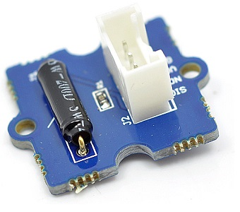        | Digital         | Grove - Tilt Switch                          | Logs the Tilt sensor info                            | [Code](Examples/ButtonTiltMovementSensor/main.cpp) | Any port except P9        | 
| 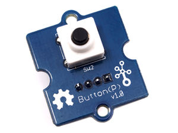             | Digital         | Grove - Button Switch                        | Logs the Button sensor info                          | [Code](Examples/ButtonTiltMovementSensor/main.cpp) | Any port except P9        |
| 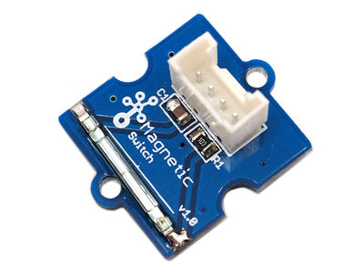    | Digital         | Grove - Magnetic Switch                      | Logs the Magnetic sensor info                        | [Code](Examples/ButtonTiltMovementSensor/main.cpp) | Any port except P9        |
| 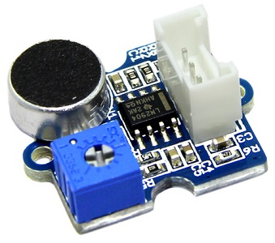    | Analog          | Grove - Loudness Sensor                      | Logs the Loudness sensor info                        | [Code](Examples/LoudnessSensor/main.cpp)           | P1 or P2                  |
| 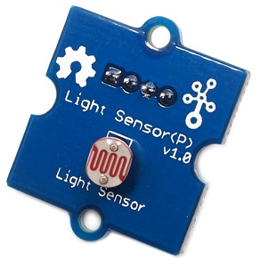       | Analog          | Grove - Light Sensor                         | Logs the Light sensor info                           | [Code](Examples/LightSensor/main.cpp)              | P1 or P2                  |
| 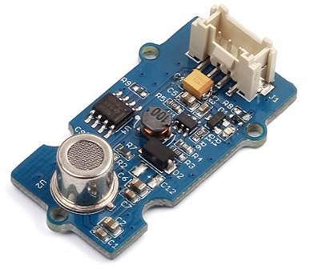 | Analog          | Grove - Air Quality Sensor                   | Logs the Air Quality sensor info                     | [Code](Examples/AirQualitySensor/main.cpp)         | P1 or P2                  |
| 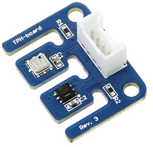          | I2C             | Grove - Temperature Pressure Humidity Sensor | Logs the Temperature Pressure Humidity sensor info   | [Code](Examples/TPH/main.cpp)                      | P9                        |    
| 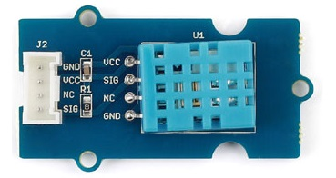       | OneWire         | Grove - DHT22 Temperature Humidity Sensor    | Logs the DHT22 Temperature Humidity sensor info      | [Code](Examples/DTH22/main.cpp)                    | Any port except P9        |    
| 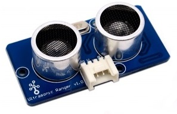  | OneWire         | Grove - Ultrasonic Ranger Sensor             | Logs the Ultrasonic Ranger sensor info               | [Code](Examples/GroveUltrasonic/main.cpp)          | Any port except P9        |    
| 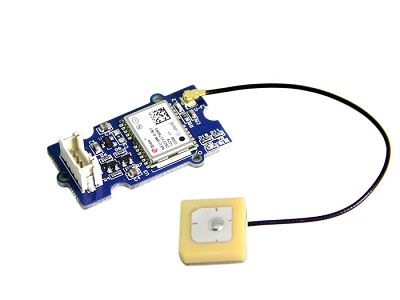         | Serial          | Grove - GPS Sensor                           | Logs the GPS sensor info                             | [Code](Examples/GPS_Sensor/main.cpp)               | P6                        |    
| 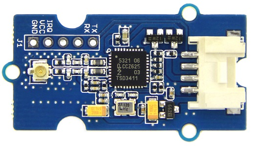         | Serial          | Grove - NFC Sensor                           | Logs the NFC sensor info                             |                                                    |                           |    

